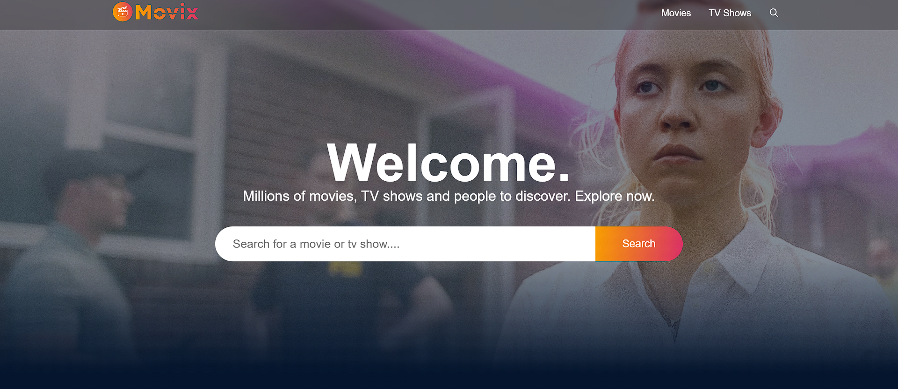
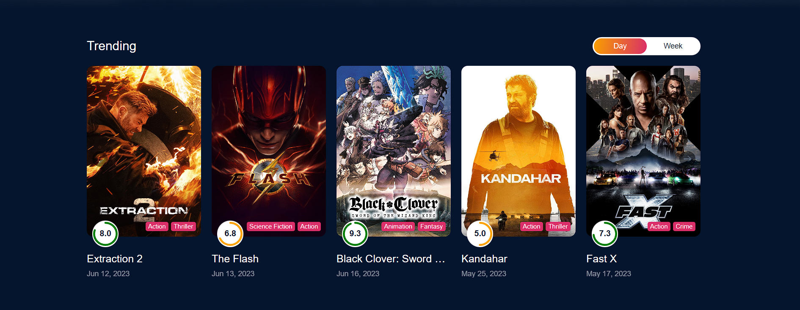
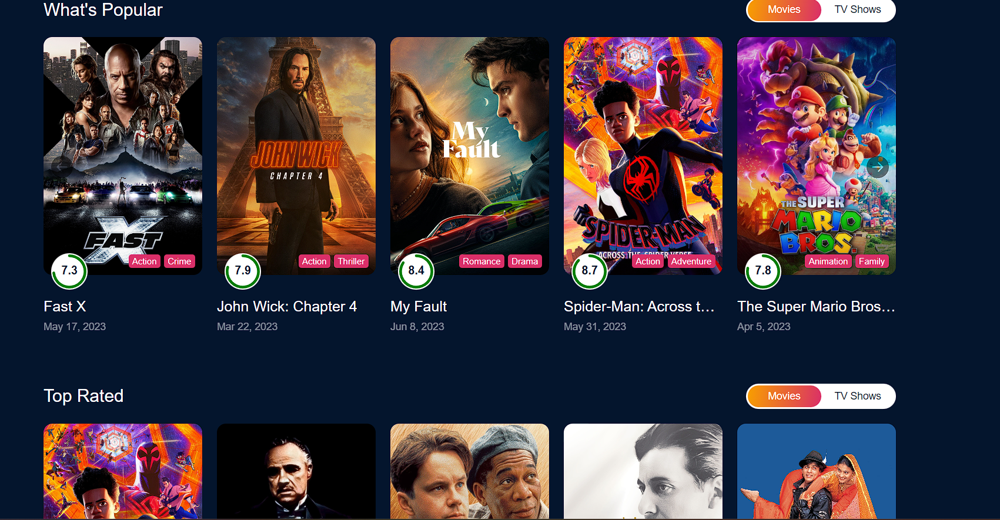
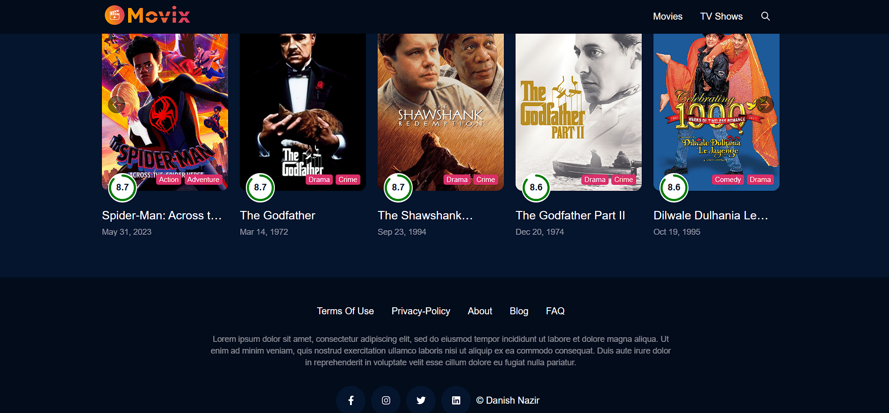
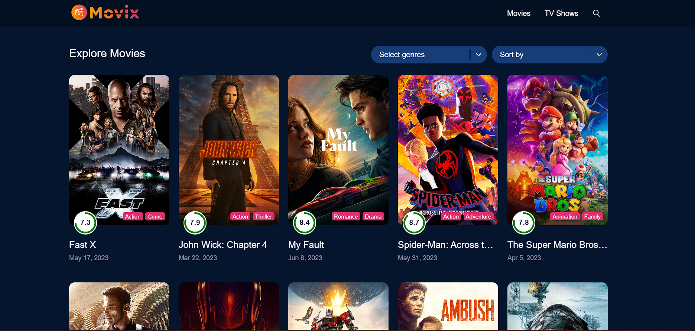
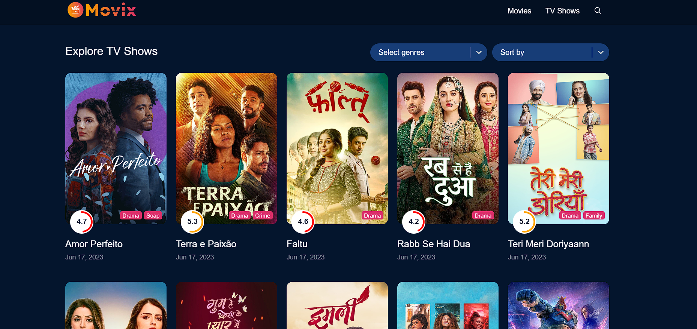

# Single-Page-Movie-App

# project-documentation

  

<h3 align="center">Singl Page Movie App</h3>
Introducing our revolutionary single-page movie app, designed to provide you with an unparalleled cinematic experience right at your fingertips. With our app, you can delve into the captivating world of movies without the hassle of navigating through multiple pages or tabs.

---

      

## 📝 Table of Contents
- [About](#about)
- [Getting Started](#getting_started)
- [Deployment](#deployment)
- [Usage](#usage)
- [Built Using](#built_using)
- [TODO](../TODO.md)
- [Contributing](../CONTRIBUTING.md)
- [Authors](#authors)
- [Acknowledgments](#acknowledgement)

## 🧐 About 

Bringing together an extensive collection of films from various genres, eras, and languages, our single-page movie app serves as a centralized hub for all your movie-related needs. The intuitive and user-friendly interface allows you to effortlessly browse through an immense library of movies, ensuring you never miss out on the latest blockbusters or hidden gems.

Discovering your next favorite film is made easy with our app's advanced search and recommendation features. You can filter movies based on genre, release year, ratings, or even specific actors and directors. Uncover curated lists and personalized recommendations tailored to your unique tastes, providing you with endless options for your next movie night.Immerse yourself in the world of cinema with our app's seamless integration of movie trailers, synopses, and reviews. Watch captivating trailers that offer a sneak peek into the film's storyline, visual effects, and performances. Read detailed synopses and insightful reviews from both critics and fellow movie enthusiasts, helping you make informed decisions and discover movies that resonate with you.

Our single-page movie app also offers a personalized watchlist feature, enabling you to curate your own collection of movies to watch later. Mark movies as "watched" or "favorite" to keep track of your viewing history and easily revisit movies you love.

Experience the convenience, efficiency, and excitement of a single-page movie app, where all the movie magic is just a click away. Unleash your inner cinephile and embark on a journey of cinematic exploration like never before.
   

Please note that the above information is based on the knowledge available up until September 2021, and there may have been changes or developments in Netflix's services and offerings since then.
## 🏁 Getting Started 
Getting Started with Create React App
This project was bootstrapped with Create React App.
### Prerequisites
Before getting started, ensure that you have the following prerequisites installed:

You need to install
Installed NPM Packages:
Redux Toolkit - https://www.npmjs.com/package/@reduxj...
React Redux - https://www.npmjs.com/package/react-r...
Axios - https://www.npmjs.com/package/axios-r...
React Player - https://www.npmjs.com/package/react-p...
Dayjs - https://www.npmjs.com/package/dayjs
React Router DOM - https://www.npmjs.com/package/react-r...
React Icons - https://www.npmjs.com/package/react-i...
React Circular Progressbar - https://www.npmjs.com/package/react-c...
React Infinite Scroll - https://www.npmjs.com/package/react-i...
React Lazy Load Image - https://www.npmjs.com/package/react-l...
For Testing API

* [Post Man](https://www.postman.com/downloads/)

### Installing

Create React App
Available Scripts
In the project directory, you can run:

npm start
Runs the app in the development mode.
Open http://localhost:3000 to view it in your browser.

The page will reload when you make changes.
You may also see any lint errors in the console.

npm test
Launches the test runner in the interactive watch mode.
See the section about running tests for more information.

npm run build
Builds the app for production to the build folder.
It correctly bundles React in production mode and optimizes the build for the best performance.

The build is minified and the filenames include the hashes.
Your app is ready to be deployed!

See the section about deployment for more information.

npm run eject
Note: this is a one-way operation. Once you eject, you can't go back!

If you aren't satisfied with the build tool and configuration choices, you can eject at any time. This command will remove the single build dependency from your project.

Instead, it will copy all the configuration files and the transitive dependencies (webpack, Babel, ESLint, etc) right into your project so you have full control over them. All of the commands except eject will still work, but they will point to the copied scripts so you can tweak them. At this point you're on your own.

You don't have to ever use eject. The curated feature set is suitable for small and middle deployments, and you shouldn't feel obligated to use this feature. However we understand that this tool wouldn't be useful if you couldn't customize it when you are ready for it.

Learn More
You can learn more in the Create React App documentation.

To learn React, check out the React documentation.

Code Splitting
This section has moved here: https://facebook.github.io/create-react-app/docs/code-splitting

Analyzing the Bundle Size
This section has moved here: https://facebook.github.io/create-react-app/docs/analyzing-the-bundle-size

Making a Progressive Web App
This section has moved here: https://facebook.github.io/create-react-app/docs/making-a-progressive-web-app

Advanced Configuration
This section has moved here: https://facebook.github.io/create-react-app/docs/advanced-configuration

Deployment
This section has moved here: https://facebook.github.io/create-react-app/docs/deployment

npm run build fails to minify
This section has moved here: https://facebook.github.io/create-react-app/docs/troubleshooting#npm-run-build-fails-to-minify

IntelliJ IDEA Community Edition:
These instructions will help you build IntelliJ IDEA Community Edition from source code, which is the basis for IntelliJ Platform development. The following conventions will be used to refer to directories on your machine:

<USER_HOME> is your home directory.
<IDEA_HOME> is the root directory for the IntelliJ source code.
Getting IntelliJ IDEA Community Edition Source Code
IntelliJ IDEA Community Edition source code is available from github.com/JetBrains/intellij-community by either cloning or downloading a zip file (based on a branch) into <IDEA_HOME>. The default is the master branch.

The master branch contains the source code which will be used to create the next major version of IntelliJ IDEA. The branch names and build numbers for older releases of IntelliJ IDEA can be found on the page of Build Number Ranges.

These Git operations can also be done through the IntelliJ IDEA user interface.

Speed Tip: If the complete repository history isn't needed then using a shallow clone (git clone --depth 1) will save significant time.

On Windows: Two git options are required to check out sources on Windows. Since it's a common source of Git issues on Windows anyway, those options could be set globally (execute those commands before cloning any of intellij-community/android repositories):

git config --global core.longpaths true
git config --global core.autocrlf input
IntelliJ IDEA Community Edition requires additional Android modules from separate Git repositories. To clone these repositories, run one of the getPlugins scripts located in the <IDEA_HOME> directory. These scripts clone their respective master branches. Make sure you are inside the <IDEA_HOME> directory when running those scripts, so the modules get cloned inside the <IDEA_HOME> directory.

getPlugins.sh for Linux or macOS.
getPlugins.bat for Windows.
Note: Always git checkout the intellij-community and android Git repositories to the same branches/tags.

Building IntelliJ Community Edition
Version 2023.1.1 or newer of IntelliJ IDEA Community Edition or IntelliJ IDEA Ultimate Edition is required to build and develop for the IntelliJ Platform.

Opening the IntelliJ Source Code for Build
Using IntelliJ IDEA File | Open, select the <IDEA_HOME> directory.

Project pictures:

### And coding style tests
During debugging,the output is shown below,

## ⛏️ Built Using 
- [MongoDB](https://www.mongodb.com/) - Database
- [Express](https://expressjs.com/) - Server Framework
- [React](https://legacy.reactjs.org/docs/getting-started.html) - Web Framework
- [NodeJs](https://nodejs.org/en/) - Server Environment

## ✍️ Authors 
We are grateful to the authors of existing related projects for their ideas and collaboration:

@skill-lync

See also the list of [contributors](https://github.com/skill-lync-cs/project-documentation) who participated in this project.

## 🎉 Acknowledgements 
- Skill-Lync
